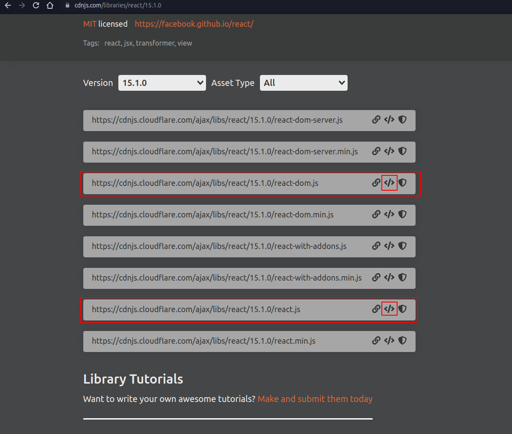
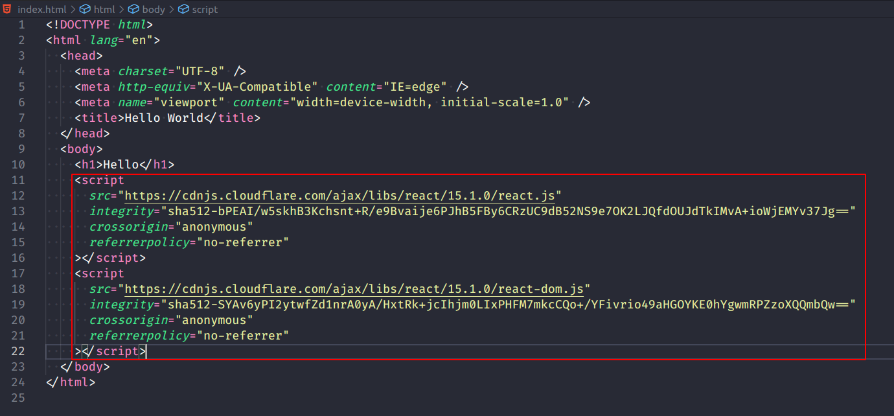
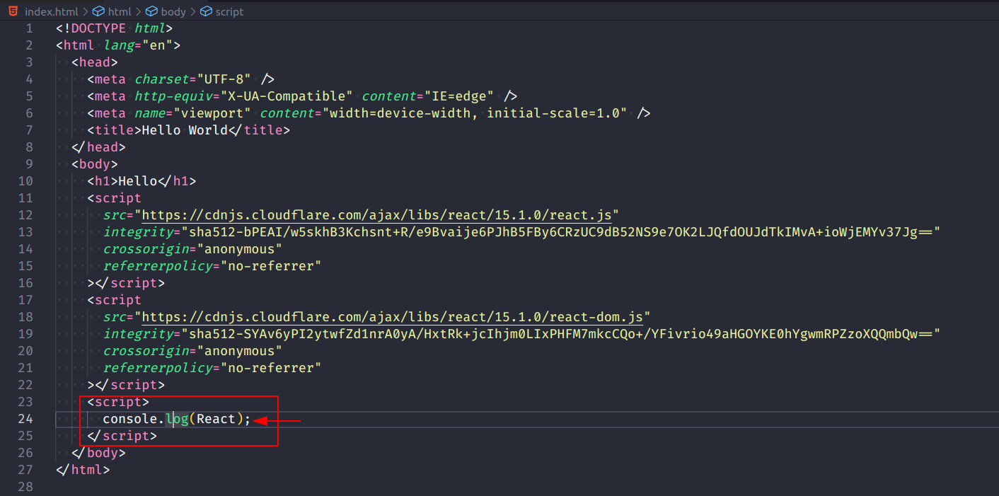
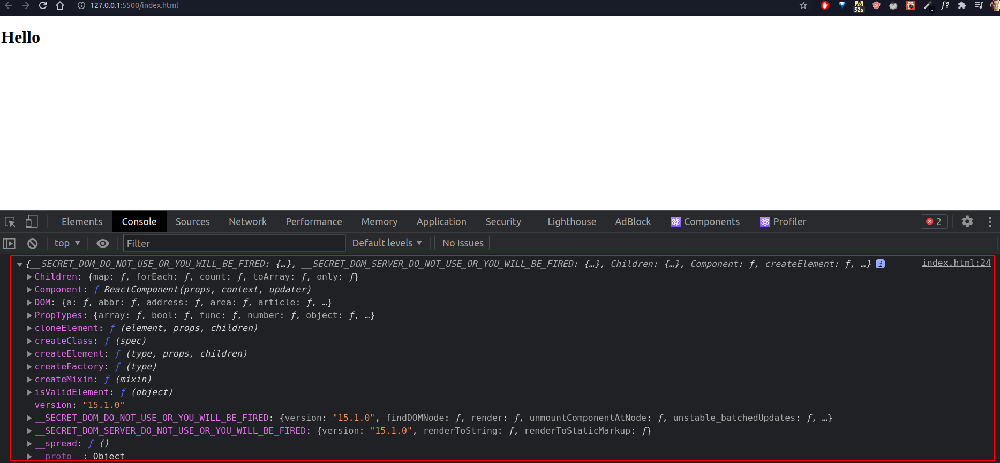
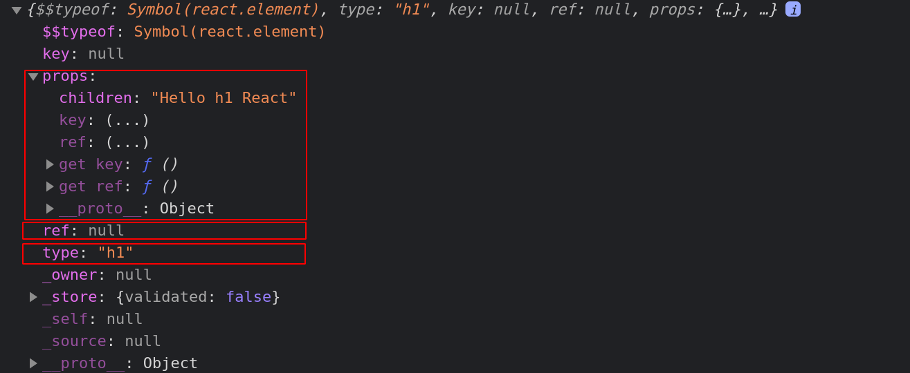

### Começando a Trabalhar com o React

- Podemos adicionar a biblioteca React ao nosso projeto, através de scripts retirados da cdn;

- Vamos começar trabalhando com a versão 15.1.0;

- [Link da cdnjs.com](https://cdnjs.com/libraries/react/15.1.0)

#### Importando os scripts no `index.html`

- Vamos importar as bibliotecas `react` e `react-dom`;



- Importamos os scripts no nosso arquivo `index.html`;



- Se adicionarmos mais uma tag `script` ao nosso código, e dermos um `console.log(React)`, teremos algo semelhante a isso.

- Imagem do `index.html`;



- Screenshot do browser com todas as propriedades do React



### Como criar um elemento no React?

- Basta fazer isso:

```javascript
<script>
  const h1 = React.createElement('h1', null, 'Hello h1 React'); console.log(h1);
</script>
```

- Se dermos um `console.log(h1)`, teremos algo semelhante a isso:



- Onde:
  - `h1`: tipo do elemento que estou criando;
  - `ref`: a referência, setada como `null`;
  - `props`: que é um objeto com uma chave `children`, que setamos como `Hello h1 React`;

### Como renderizar um elemento do React?

1. Insere um local onde ele vai ser renderizado;

```javascript
<div id="app"></div>
```

2. Usa o `ReactDom.render` passando o elemento que vai ser renderizado, e o local onde será renderizado;

```javascript
<script>
  const h1 = React.createElement('h1', null, 'Hello h1 React');
  ReactDOM.render(h1, document.getElementById('app')); console.log(h1);
</script>
```
