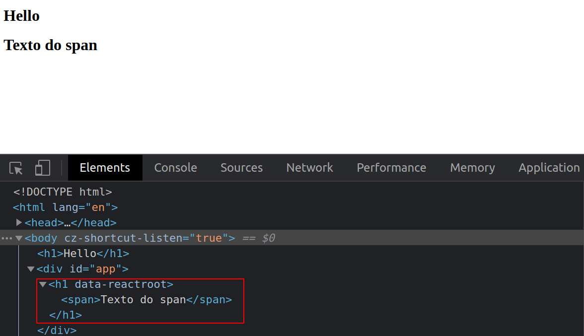

### Como criar elementos aninhados no React?

- Basta que, no lugar de, '`Hello h1 React`', como abaixo, façamos:

```javascript
<script>
  const h1 = React.createElement('h1', null, 'Hello h1 React');
  ReactDOM.render(h1, document.getElementById('app')); console.log(h1);
</script>
```

```javascript
<script>
  const h1 = React.createElement( 'h1', null, React.createElement('span', null,
  'Texto do span') ); ReactDOM.render(h1, document.getElementById('app'));
  console.log(h1);
</script>
```

- Vejamos como isso fica no DOM;


