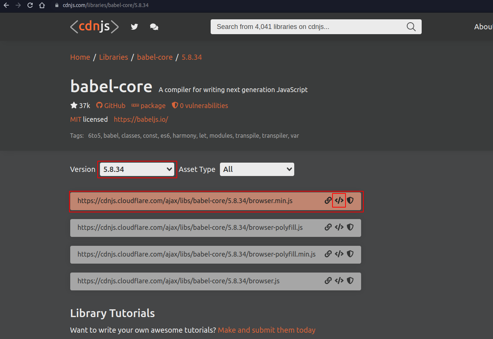

## O que é `JSX`?

- É uma extensão de sintaxe para JavaScript;

- Exemplo:

```javascript
const element = <h1>Hello, world!</h1>;
```

- Isso não é nem um HTML, e nem uma string;

- `JSX` produz "elementos" do React;

- Se eu tentar renderizar um elemento da seguinte maneira, não lograrei êxito;

- Isso porque precisamos da CDN do Babel;

- O Babel é uma ferramenta utilizada para compilar Javascript;

```javascript
<script>
  ReactDOM.render(
  <h1>Hello World React</h1>, document.getElementById('app') ); console.log(h1);
</script>
```

- Vejamos a imagem abaixo;



- O nosso script fica assim:

```javascript
<script type="text/babel">
  ReactDOM.render(
  <h1>Hello World React</h1>, document.getElementById('app') );
</script>
```
